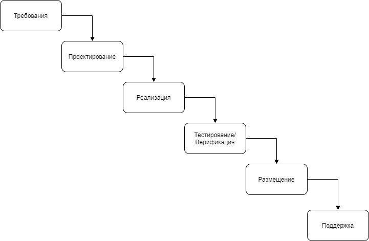
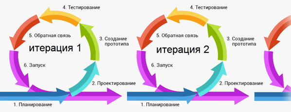

# 1.3 - 1.4

* Каскадная модель (водопад) - нет гибкости, но есть сроки и результат.

 

* Agile - слишком много гибкости и низкое качество продукта.

 

## Фреймворк SCRUM + Kanban

* Backlog - содержит User Stories

* Спринт - от 2-х недель до 2-х месяцев, набор задач, который приводит к инкременту проекта.

* Планирование спринта - для каждой задачи определяем трудозатраты.

* Ежедневные встречи

* Ретроспектива

* SCRUM Master

* Product Owner

* Kanban
