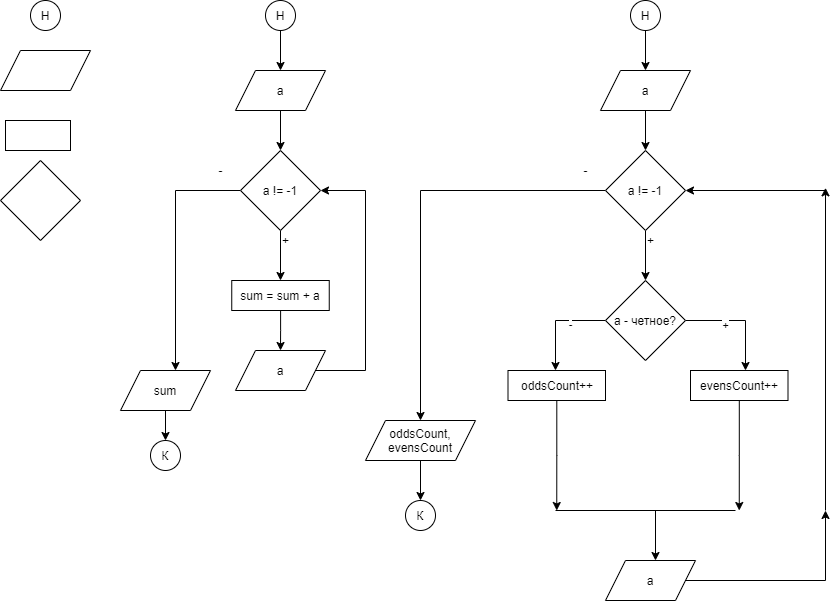

# 1.5

* Алгоритм - последовательность действий, выполняющих решение какой-либо задачи.

* Свойства алгоритма:

- ввод
- вывод
- конечность
- эффективность
- однозначность (детерминированность)

* Структуры управления - линейная структура, условие, цикл. 

* Теорема Бема-Якопини - любой алгоритм можно выразить с помощью этих структур управления.

* Оператор `%` - берет остаток от деления, например `7 % 2 = 1`, потому что `7 = 2 * 3 + 1`, `11 % 3 = 2`, потому что `11 = 3 * 3 + 2`

## Базовая формулировка задачи

 

```
Пусть есть последовательность чисел 

a0, a1, a2, ..., aN

N -> infinity, aN -> -1
``` 

### Задача 1

* Вывести сумму всех чисел последовательности.

### Задача 2

* Посчитать количество всех четных чисел и сумму всех нечетных чисел.

### Задача 3

* Найти минимум среди всех чисел последовательности

```
Считать -> a

min = a

ПОКА a != -1:
	ЕСЛИ min > a:
		min = a

	Считать -> a

Вывести -> min
```

### Задача 4

* Вывести минимальную сумму цифр для четных чисел (все числа - положительные), числа в диапазоне 0 до 9999

* Пример:

```
112 -> четное, сумма цифр - 1 + 1 + 2 = 4
117 -> нечетное
67 -> нечетное
88 -> четное, сумма цифр - 8 + 8 = 16
16 -> четное, сумма цифр - 1 + 6 = 7
-1

ОТВЕТ: 4
```

* Решение:

```
Считать -> a

digitsSum = 0
minDigitsSum = 37

ПОКА a != -1
	digitsSum = 0
	ЕСЛИ a - четное:
		ПОКА a != 0:
			lastDigit = a % 10
			digitsSum = digitsSum + lastDigit
			a = a / 10

		ЕСЛИ digitsSum < minDigitsSum:
			minDigitsSum = digitsSum

	Считать -> a

Вывести -> minDigitsSum
```

* Ход выполнения вложенного цикла:

```
735

last = 5
digitsSum = 0 + 5
a = 735 / 10 = 73

last = 3
digitsSum = 5 + 3
a = 73 / 10 = 7

last = 7
digitsSum = 8 + 7
a = 7 / 10 = 0
```