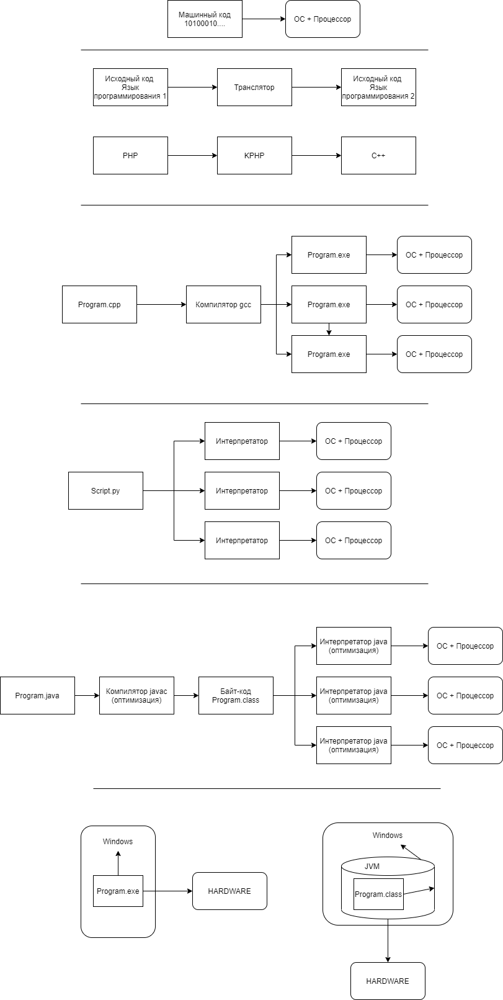

# 1.6

# Как код становится программой?

`КОД -> ИСПОЛНЯЕМЫЙ МОДУЛЬ`

* Исходный код - код на каком либо языке программирования, который понятен человеку.

* Исполняемый модуль - код на языке программирования, который понятен компьютеру (бинарный код - `110101011...`), в частности процессору.

* `Транслятор` - программа, которая умеет переводить программу с одного языка программирования, на другой язык программирования.

`Код на исходном языке программирования -> транслятор -> Код на целевом языке программирования`

Например: KPHP, там транслятор переводит программу с `PHP` на `C++`.

* Компилятор - программа, разновидность транслятора, которая умеет перевдить программу с языка программирования высокого уровня (понятен человеку) в программу на языке программирования низкого уровня (понятен компьютеру)

Например: `gcc`, Program.cpp -> Program.exe (машинный код). Примерами компилируемых языков являются `C/C++/Pascal/Basic`

* Интерпретатор - транслятор, который не сразу переводит всю программу в машинный код, а делает это построчно и пооператорно в момент выполнения. Примерами таких языков являются - Python, JavaScript, PHP.

В чем разница? В компилируемых языках программа сразу после компиляции становится исполняемой, в интерпретируемых языках - в процессе запуска. Программы компилируемые работают быстрее, чем интерпретируемые.

Для чего нам нужны интерпретируемые? Потому что машинный код у каждой архитектуры ЭВМ свой. Поэтому, если вы скомпилировали программу для архитектуры Intel, то она может не заработать на AMD. Поэтому для каждого типа архитектуры нужно программу заново компилировать. 

В интерпретируемых языках проблема решена с помощью создания интерпретаторов для всех типов архитектур. Таким образом, мы достигаем кроссплатформенности, один и тот же код работает везде без необходимости перекомпилировать его.

* Смешанный вариант - хотим обеспечить скорость работы программы и кроссплатформенность - Java. Изначально программа "компилируется" в байт-код (.class). Байт-код - это код виртуальной машины Java и он одинаковый для всех типов JVM. В свою очередь, под каждую архитектуру существует свой вариант JVM и поэтому мы достигаем кросс-платформенности. Байт-код - супероптимизированный код, поэтому он выполняется быстрее, чем в случае с обычной интерпретацией.

* `JVM` - виртуальная машина Java, `эмулирует операционную систему и железо`. Программы на Java запускаются внутри этой изолированной среды.

