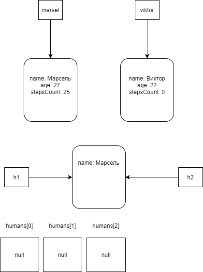

# ООП

* Класс - абстракция. На основе этой абстракции можно создавать конкретные экземпляры. В классе описываются свойства объекта,
конкретные значения свойств объекта определяют его состояние.

* Объекты - экземпляры класса, создаются на основе (по шаблону) описанного класса. 
* Объект обладает состоянием и поведением. 
* Состояние объекта описывается конкретными значениями полей. У каждого объекта свой набор этих полей.
Сами поля описаны в классе, а в каждом объекте свой, конкретный набор.

* Особенность объектов заключается в том, что они объединяют в себе и данные (поля) и алгоритмы (методы) 
- инкапсуляция.

* Второе определение инкапсуляции - внутренняя структура объектов может быть защищена от некорректных значений,
поданных извне. Защитить можно с помощью модификаторов доступа, например, `private`

Итог:

- Класс состоит из полей, методов, методов доступа.
- Поля всегда закрыты от внешнего изменения, взаимодействие с полями происходит только с помощью методов доступа.
- Поля всегда `private`, методы, которые могут использоваться везде - `public`

