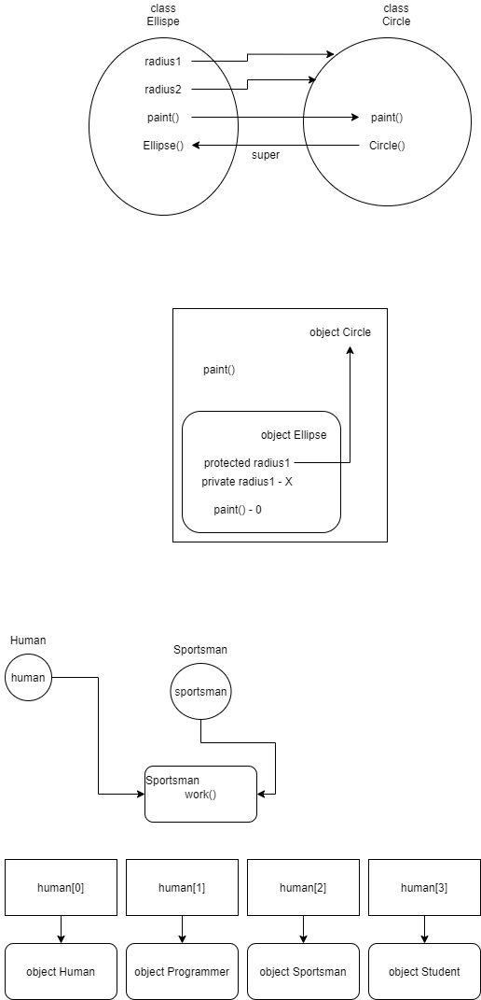

# Наследование

* Третий принцип ООП - позволяет избежать дублирования кода посредством копирования функциональности
другого класса.

* `extends` - ключевое слово, которое делает один класс потомком другого. 

* При наследовании вся информация, которая есть в классе-предке передается в класс-потомок (вся, кроме конструкторов).

* `protected` - модификатор доступа, обеспечивает уровень доступа "защищенный", т.е. член класса доступен для потомков.

## Полиморфизм

* Четвертый принцип ООП - позволяет объектом разных типов вести себя так, будто они принадлежат одному типу.
* Возможно только с использованием наследования и восходящего преобразования.

* Для того, что бы использовать полиморфизм, каждый из потомков должен переопределить метод предка.
* Переопределение метода - это заново указываем в потомке этот метод, но с другой реализацией.