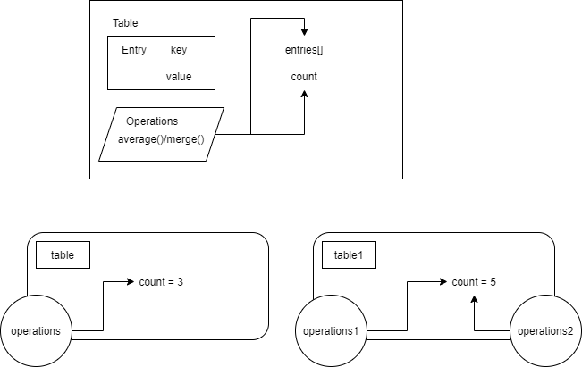

# Вложенные классы

* `Ассоциативный массив` - тип данных, который очень похож на массив, но в качестве индексов могут быть
объекты любых типов.

```
"Марсель" -> 27
"Виктор" -> 24
"Максим" -> 29
```

* Вложенные классы (nested-классы) - классы, описанные внутри других классов. 
Нужны для повышения читаемости кода, организации кода и для повышения инкапсуляции. 

* Внутренние классы (inner, без static) - классы, описанные внутри других классов. Так же, как и вложенные,
дают плюс к читаемости, организации и инкапсуляции.

* Внешний класс знает все о вложенном классе (даже о приватных полях)

## В чем разница и для чего это нужно?

Вложенные классы используются тогда, когда нам просто нужно организовать код таким образом,
чтобы один тип был описан внутри другого и ВСЕ.

Внутренние классы используются тогда, когда объекты этих классов нуждаются в информации об объектах
внешних классов.

