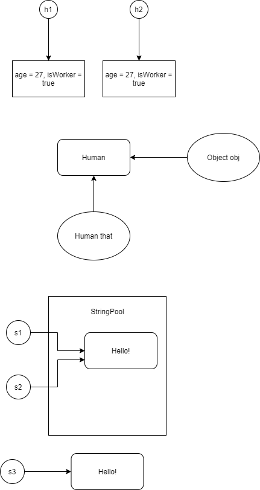

# Классы Object и String



## Object

* Задача класса `Object` задать общее поведение для всех классов в Java.

* В методе `System.out.println` вызывается `String.valueOf(x)`, которая содержит следующий код:

```
public static String valueOf(Object obj) {
        if (obj == null) {
            return "null"
        } else {
            return obj.toString();
        }
}
```

* В классе `Object` есть метод `String toString`, который мы можем переопределить, если хотим получить строковое представление объекта.
* В классе `Object` есть метод `boolean equals(Object obj)` для проверки эквивалентности объектов. 
Данный метод необходимо переопределять для своих объектов.

## String

* Объекты класса неизменяемые. Любая операция создает новую строку, а не изменяет старую.
* Сам класс нельзя наследовать.

### Принцип работы equals у строк

```
public boolean equals(Object anObject) {
        // проверяем делаем ли проверку сами с собой
        if (this == anObject) {
            return true;
        }
        // если второй объект - экземпляр класа String, то можем сравнивать
        if (anObject instanceof String) {
            // явное преобразование в строку
            String anotherString = (String)anObject;
            // берем длину нашей строки
            int n = value.length;
            // если длины строк совпали
            if (n == anotherString.value.length) {
                // то делаем проверки дальше
                
                // в v1 кладем массив символов нашей строки
                char v1[] = value;
                // в v2 кладем массив символов другой строки
                char v2[] = anotherString.value;
                int i = 0;
                // пока не пройдем длину строк
                while (n-- != 0) {
                    // если не совпали i-ые символы строк
                    if (v1[i] != v2[i])
                        // возвращаем false
                        return false;
                    i++;
                }
                // если все символы совпали, мы ни разу не попали в return false
                // возвращаем true
                return true;
            }
        }
        // если на входе - не строка - возвращаем false
        return false;
    }
```