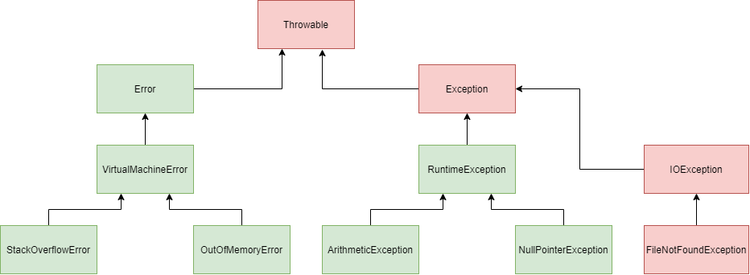

# Исключительные ситуации



## Исключения

* Ошибки компиляции - возникают при нарушении синтаксиса языка.

* Ошибки времени выполнения - возникают в процессе работы программы.

* В Java все ошибки времени выполнения оборачиваются в объекты определенных классов. Такие ошибки
  называются исключительными ситуациями (исключениями, exceptions).

### Примеры

* `ArithmeticException` - исключение, возникающие при арифметических операциях.

* `NullPointerException` - исключение, возникающие при обращении к объектной переменной, для которой задан объект.

* `OutOfMemoryError` - исключение, возникающее при превышении лимитов для памяти VM.

* `StackOverflowError` - исключение, возникающее при переполнении стека вызовов.

* `VirtualMachineError` - исключения, возникающие при нарушениях работы VM.

* `Error` - исключения, возникающие при нарушениях работы VM, "железа" или ОС.

* `FileNotFound` - исключение, которое выбрасывается при обращении к несуществующему файлу.

* `IOException` - исключение, которое выбрасывается при каких-либо проблемах с вводом выводом.

* `Checked`/`Проверяемые` - категория исключений, для которых мы обязаны прописать `try-catch`.

### `Throwable`

* Предок всех классов-исключений.

```java
class Throwable {
    // сообщение, которым сопровождается исключение
    private String detailMessage;
    // другая ошибка, которая стала причиной текущей ошибки
    private Throwable cause = this;

    // стек вызовов, который привел к возникновению ошибки
    private StackTraceElement[] stackTrace;
}
```

```java
public final class StackTraceElement implements java.io.Serializable {
    // Normally initialized by VM (public constructor added in 1.5)
    private String declaringClass;
    private String methodName;
    private String fileName;
    private int    lineNumber;
    // ...
}
```

### Ключевые слова для работы с исключениями

* `try`, `catch`, `throw`,

* `throws` - ставится, чтобы показать, что метод может выбросить проверяемое исключение. Если вы
  у метода указали `throws`, то вам нет необходимости выполнять перехват исключения в `try-catch`
  внутри метода. Вы просто снимаете ответственность с исходного метода и перекладываете ее в вызывающий код.

* Использование `throws` в вашем коде - плохая практика.

* Если метод выбрасывает проверяемое исключение, вы обязаны об этом заявить через `throws`.