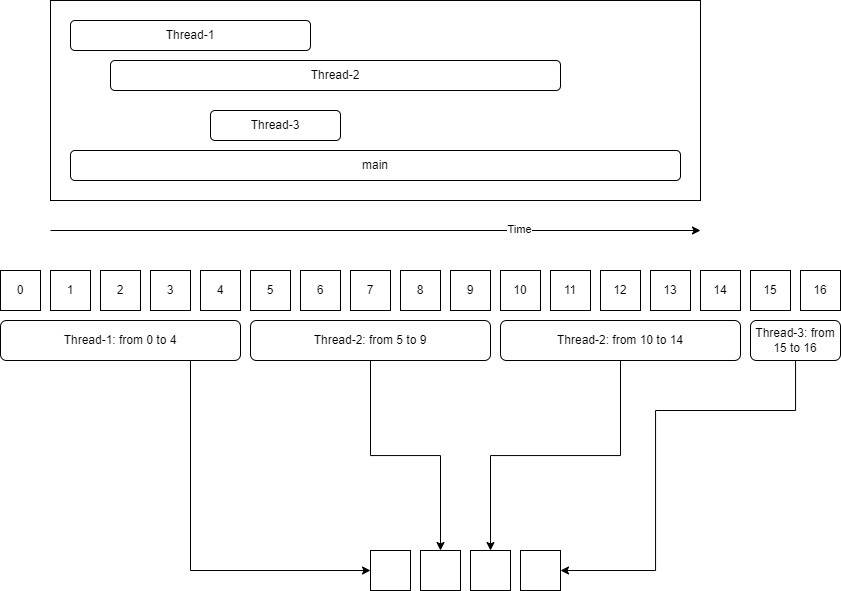

## Многопоточность

* Процесс - приложение, у каждого процесса своя область памяти и набор потоков.

* Поток вычислений - элемент процесса.

### Методы потоков:

* `start()` - запуск потока.

* `Thread.currentThread()` - получить экземпляр текущего потока.

* `Thread.sleep()` - усыпляет текущий поток.

